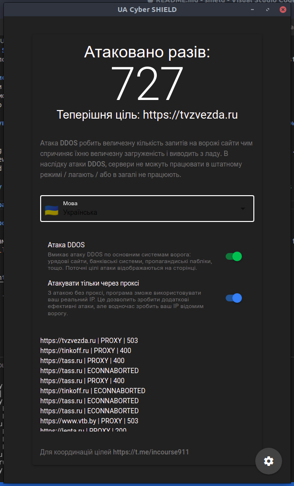

# UA Cyber SHIELD

*See this README [in English](README-en.md)*

**Система волонтерської кібероборони України**

- Ком'юніті: [Discord](https://discord.gg/7BfJ9JKQ98)
- Відео інструкція [українською](https://youtu.be/snTzpRt7a5k)

## Для кіберзахисників

1. Програми знаходяться в [релізах](https://github.com/opengs/uashield/releases)
2. Вибираємо найновший реліз і свою платформу
3. Скачуємо і запускаємо

**В користувачів на Linux можливо треба буде додати аргумент `--no-sandbox`. Windows повинен працювати без всяких додаткових речей**

## Як це працює

Наш центр волонтерів займається всією тяжкою роботою: моніторингом цілей, підтримкою технічної структури, координацією атак, передачею даних до програм клієнтів, тощо.
Тому на момент атаки всі підготовчі дані є.
Вам залишається тільки встановити програму і приєднатися.
Цілі міняються автоматично і підвантажуються з центру координації

## Інтерфейс програми

## Збірка коду

1. Клонуємо репозиторій: `git clone https://github.com/opengs/uashield.git`
2. Встановлюємо залежності: `cd uashield && npm install`
3. Запускаємо білд: `npm run build:electron`
4. Запускаємо виконавчий файл в `./dist/electron` або електрон версію: `npm run start:electron`

## Headless версія (Docker)

1. Збірка імежду: `docker build . -t uashield`
2. Запуск: `docker run uashield 500 true` - де `500` - кількість потоків, і `true` | `false` чи ви бажаєте використати проксі

## Docker-compose версія

1. Запуск: `docker-compose up -d`
2. Відредагуйте значення змінних `WORKERS` та `USEPROXY` в файлі `docker-compose.yml` - де `256` - кількість потоків, і `true` | `false` чи ви бажаєте використати проксі

## Деплой на Raspberry Pi

